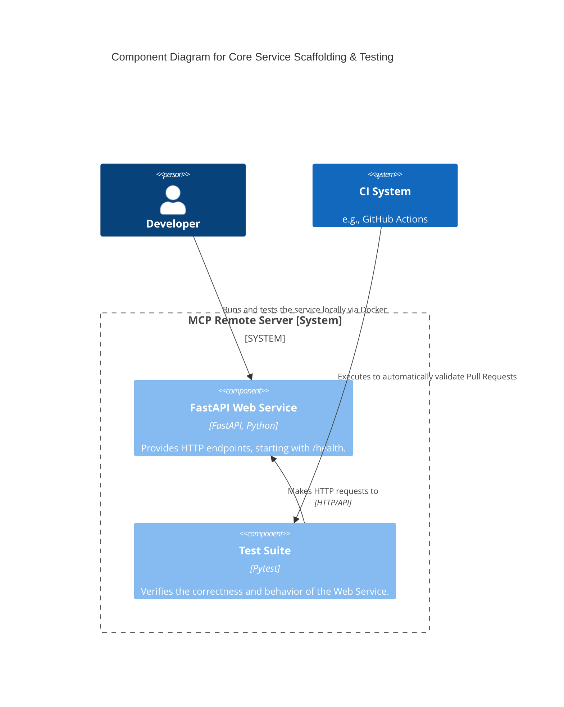
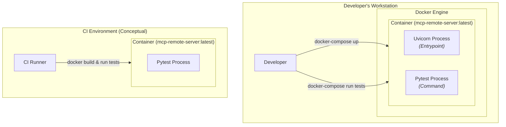

#### **Core Service Scaffolding with Integrated Testing**

*   **Problem:** The project lacks an executable foundation. To build a reliable service, we need a basic application structure, a consistent way to build and run it (containerization), and an integrated quality gate (automated testing) from the very beginning. Without these, any future development would be slow, error-prone, and difficult to validate.

*   **Solution:**
    1.  Initialize a FastAPI application with a single `HTTP GET` endpoint at `/health` that returns a `{"status": "ok"}` JSON response.
    2.  Integrate the `pytest` framework with an initial test case that programmatically verifies the `/health` endpoint returns a `200 OK` status code and the correct JSON body.
    3.  Develop a multi-stage `Dockerfile` to build a lean, secure, and production-ready container image.
    4.  Create a `docker-compose.yml` file to simplify the orchestration of running the service and executing the test suite in a local containerized environment.

*   **Trade-offs:**
    *   **Pros:**
        *   Establishes a "quality-first" culture by embedding the testing framework in the initial deliverable.
        *   Dockerization provides a consistent, reproducible environment for both the application and its tests, eliminating environmental drift between developer machines and CI/CD runners.
        *   Creates a tangible, runnable artifact that serves as the validated base for the CI/CD pipeline in Issue #2.
    *   **Cons:**
        *   Slightly increases the initial setup time compared to simply writing the application code. This is a deliberate and strategic investment in long-term quality and development velocity.
        *   The core business logic (the MCP tools) is intentionally deferred to focus on building a robust, high-quality foundation first.

#### **Design the Architecture-as-Code (AaC)**

*   **Logical View (C4 Component Diagram)**

    *This diagram describes the logical building blocks of the system and their relationships for this issue.*

*   **Physical View (Deployment Diagram)**

    *This diagram maps the logical components to specific technologies and runtime environments.*

*   **Component-to-Resource Mapping Table**

| Logical Component | Physical Resource | Rationale (Why this choice?) |
| :--- | :--- | :--- |
| **FastAPI Web Service** | **Docker Container running a Uvicorn process** | This is the industry standard for serving Python ASGI applications. Containerization is a core requirement from the PRD, ensuring environmental consistency, simplifying dependencies, and enabling a cloud-native deployment strategy. |
| **Test Suite** | **Docker Container running a Pytest process** | Executing tests within the *exact same container image* that will be deployed to production is a critical best practice. It guarantees that the tested artifact is the final artifact, eliminating the risk of works-on-my-machine/fails-in-CI scenarios. Pytest is the de facto standard for testing in the Python ecosystem. |
