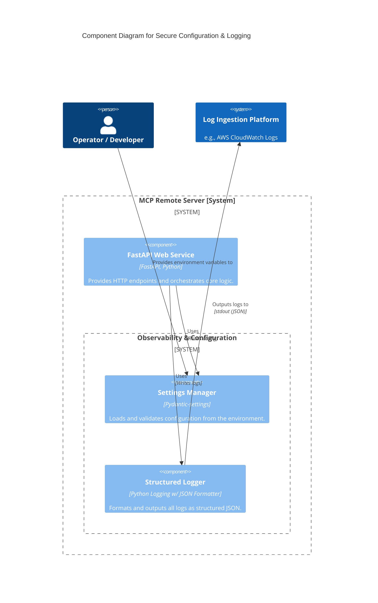
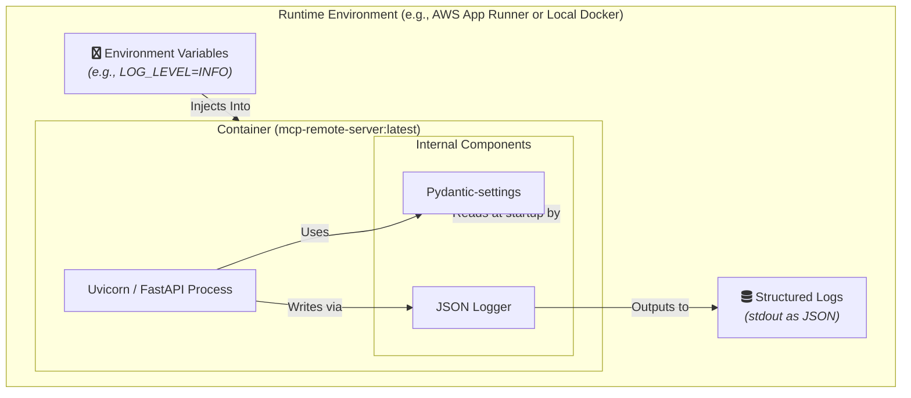

#### **Secure Configuration & Structured Logging**

*   **Problem:**
    1.  The service currently has no mechanism to manage configuration (e.g., port numbers, log levels) without modifying the source code. This is inflexible and prevents the same application artifact from being promoted across different environments (dev, staging, production).
    2.  Application logs are unstructured plain text. This makes them extremely difficult to search, parse, and analyze in an automated way, rendering effective monitoring and alerting in a cloud environment like AWS CloudWatch nearly impossible.

*   **Solution:**
    1.  Introduce a `Settings Manager` component, implemented using the `pydantic-settings` library. This component will load all configuration from environment variables, strictly separating configuration from code, in alignment with 12-Factor App principles.
    2.  Introduce a `Structured Logger` component. This will be implemented by configuring Python's standard `logging` module with a JSON formatter. All application logs will be written to `stdout` as machine-readable JSON objects.

*   **Trade-offs:**
    *   **Pros:**
        *   **Security & Flexibility:** Secrets and environment-specific settings are never hardcoded. The same Docker image can be deployed anywhere by providing the appropriate environment variables.
        *   **Enhanced Observability:** Structured JSON logs are the industry standard for modern cloud applications. They enable powerful querying, metrics creation, and reliable alerting in log aggregation platforms (e.g., CloudWatch, Datadog).
        *   **Improved Developer Experience:** `pydantic-settings` provides automatic type validation for configuration, catching errors early.
    *   **Cons:**
        *   Introduces one new dependency (`pydantic-settings`), which is a negligible and highly justified trade-off for the benefits gained.
        *   Requires developers to adopt the standard logging framework instead of using `print()` statements, which is a necessary discipline for building production-grade software.

#### **Design the Architecture-as-Code (AaC)**

*   **Logical View (C4 Component Diagram)**

    *This diagram shows the new logical components being introduced *inside* the existing FastAPI service.*

*   **Physical View (Deployment Diagram)**

    *This diagram shows how the container's runtime is influenced by external configuration and how its output is consumed.*

*   **Component-to-Resource Mapping Table**

| Logical Component | Physical Resource | Rationale (Why this choice?) |
| :--- | :--- | :--- |
| **Settings Manager** | **Pydantic-settings Library** | This is the de facto standard for configuration management in the FastAPI ecosystem. It provides type safety, validation, and strictly enforces the 12-Factor App principle of separating config from code, which is critical for secure and flexible deployments. |
| **Structured Logger** | **Python's standard `logging` module with a JSON Formatter** | Leveraging the standard library is robust and avoids unnecessary dependencies. A JSON formatter is chosen because JSON is a universal, machine-readable format that is natively supported by virtually all modern log aggregation and observability platforms, including AWS CloudWatch. |
