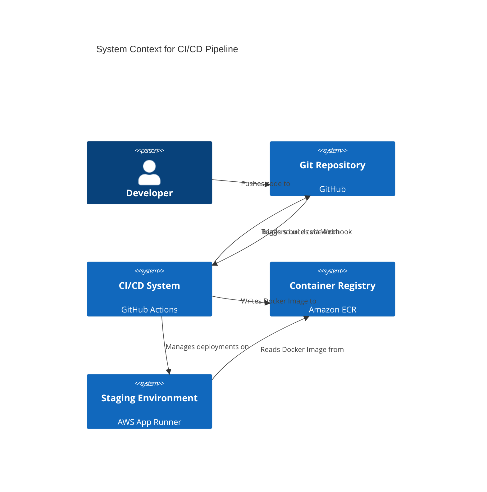
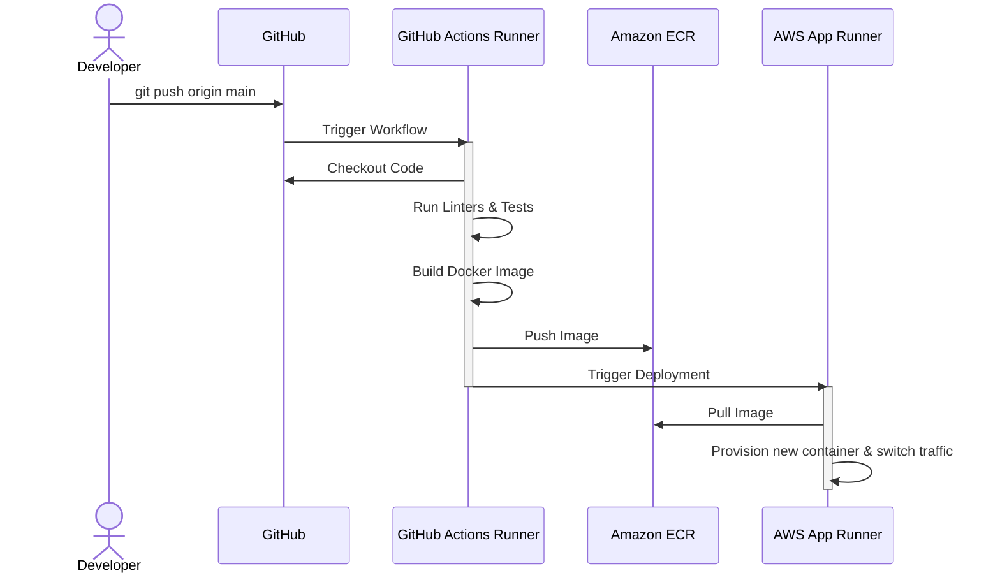

#### **End-to-End CI/CD Pipeline to Staging**

*   **Problem:** The deployment process is currently manual, non-existent, and not repeatable. This approach is slow, prone to human error, and does not provide a rapid feedback loop for developers. To effectively test our integrated service in a cloud environment, we need a fully automated "source-to-deploy" pipeline.

*   **Solution:** We will create a Continuous Integration and Continuous Deployment (CI/CD) pipeline using GitHub Actions. This pipeline will automatically trigger on every push to the `main` branch and perform the following sequence of operations:
    1.  **Test:** Run the full suite of automated tests (`pytest`) to validate the code's correctness.
    2.  **Build:** Build the application into a production-ready Docker image.
    3.  **Push:** Tag the image and push it to a private Amazon ECR (Elastic Container Registry) repository.
    4.  **Deploy:** Trigger a service update on a newly created **Staging environment** in AWS App Runner, instructing it to pull and deploy the new container image from ECR.

*   **Trade-offs:**
    *   **Pros:**
        *   **Velocity:** Greatly accelerates the delivery of new features and fixes by removing manual steps.
        *   **Reliability:** Creates a consistent, repeatable deployment process, significantly reducing the risk of configuration drift or deployment errors.
        *   **Quality Gate:** Enforces that all code must pass automated tests before it can be deployed, maintaining a high standard of quality.
        *   **Foundation for GitOps:** Establishes the `main` branch in Git as the definitive source of truth for what is deployed in the staging environment.
    *   **Cons:**
        *   **Vendor Lock-in:** Creates a dependency on specific technologies (GitHub Actions, AWS ECR, AWS App Runner). This is a strategic and acceptable trade-off for the simplicity and power of a fully managed platform.
        *   **Credential Management:** Requires the secure storage of AWS credentials as secrets within GitHub Actions to grant the pipeline deployment permissions. This must be managed carefully.

#### **Design the Architecture-as-Code (AaC)**

*   **Logical View (C4 System Context Diagram)**

    *This diagram shows the high-level systems involved in the automated deployment process and how they interact.*

*   **Physical View (Deployment Process Diagram)**

    *This diagram shows the sequence of steps, the environments they run in, and the artifacts they produce.*

*   **Component-to-Resource Mapping Table**

| Logical Component | Physical Resource | Rationale (Why this choice?) |
| :--- | :--- | :--- |
| **CI/CD System** | **GitHub Actions** | Tightly integrated with our source code on GitHub. It offers managed runners, a generous free tier, and a simple YAML-based configuration, making it the most seamless choice for our workflow. |
| **Container Registry** | **Amazon ECR (Elastic Container Registry)** | A secure, managed, and private Docker registry. Its native integration with AWS IAM and other services like App Runner drastically simplifies permissions and improves image pull performance within the AWS ecosystem. |
| **Staging Environment** | **AWS App Runner** | The ideal platform for this use case. It is a fully managed service that builds and runs containerized web applications at scale with no infrastructure overhead. It directly deploys from ECR, handles load balancing, SSL, and auto-scaling, providing the fastest path to a production-ready environment. |
