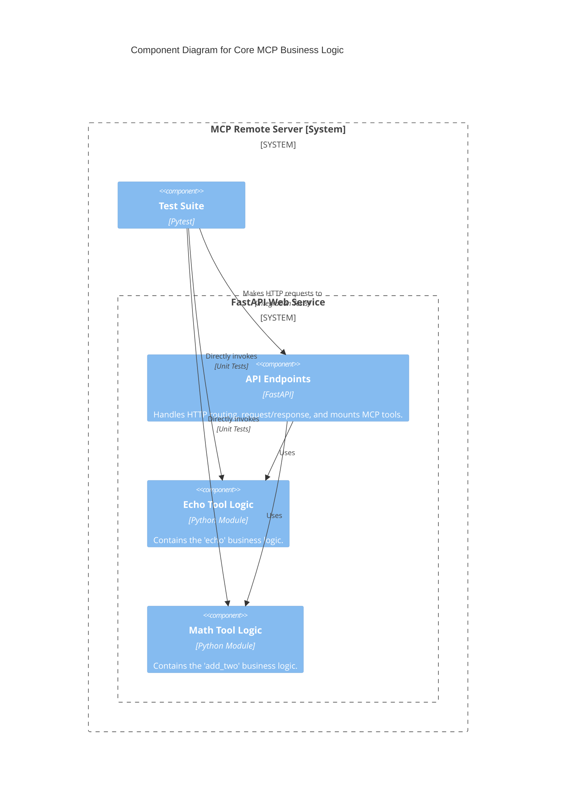
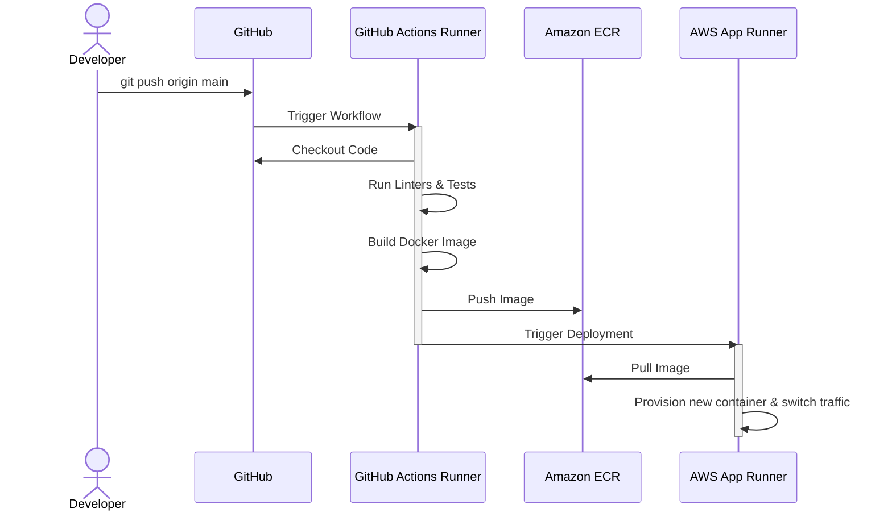

#### **Implement and Test Core MCP Business Logic**

*   **Problem:** The service is a functional "walking skeleton"—it can be configured, logged, tested, and deployed, but it performs no useful work. It does not yet satisfy the primary functional requirements of the PRD, which are to provide `echo` and `math` functionalities.

*   **Solution:**
    1.  Create two new, distinct Python modules (`echo_server.py`, `math_server.py`) to contain the business logic, ensuring a clean separation of concerns.
    2.  Implement the `echo` and `add_two` functions within these modules.
    3.  In the main FastAPI application, mount these modules as MCP tools, exposing them at the `/echo/mcp/` and `/math/mcp/` endpoints.
    4.  Add specific **unit tests** to the existing `Test Suite` that directly validate the correctness of the `echo` and `add_two` functions in isolation.

*   **Trade-offs:**
    *   **Pros:**
        *   This feature delivers the core business value required for the MVP.
        *   The logic is implemented in a modular, decoupled fashion, making it easy to test and maintain independently of the web framework.
        *   Mandating unit tests for the business logic ensures correctness and protects against future regressions.
    *   **Cons:**
        *   This is a necessary addition of complexity to the application. There are no significant negative trade-offs, as this work is the primary goal of the project.

#### **3. Design the Architecture-as-Code (AaC)**

The following artifacts define the architectural changes for this issue.

*   **Logical View (C4 Component Diagram)**

    *This diagram zooms *inside* the `FastAPI Web Service` to show the new business logic components.*

*   **Physical View (Deployment Diagram)**

    *   **Decision:** The Physical View for this issue is **unchanged**.
    *   **Rationale:** The new business logic is implemented as Python code that is packaged into the *exact same physical artifact* as before: a single Docker container. It does not introduce new infrastructure, processes, or physical deployment considerations. Therefore, the previously validated Physical View from Issue #1 remains the accurate source of truth, and creating a new, identical diagram would be redundant.

*   **Component-to-Resource Mapping Table**

| Logical Component | Physical Resource | Rationale (Why this choice?) |
| :--- | :--- | :--- |
| **API Endpoints** | **FastAPI Application Object** | This is the core of the web service, responsible for handling the web layer. FastAPI is the chosen framework per the PRD. |
| **Echo Tool Logic** | **Python Module** | A simple, self-contained Python module is the most direct and maintainable way to implement this piece of business logic. It is lightweight, requires no external infrastructure, and is easily unit-tested. |
| **Math Tool Logic** | **Python Module** | Same as above. This modular approach ensures that as we add more tools, the complexity remains manageable and the concerns are cleanly separated. |
