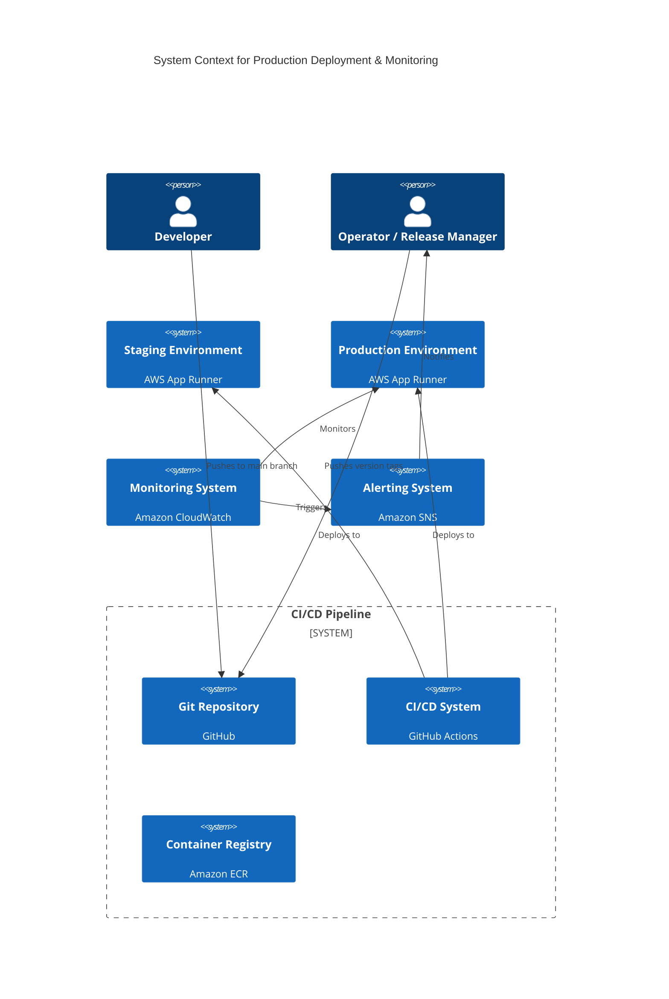
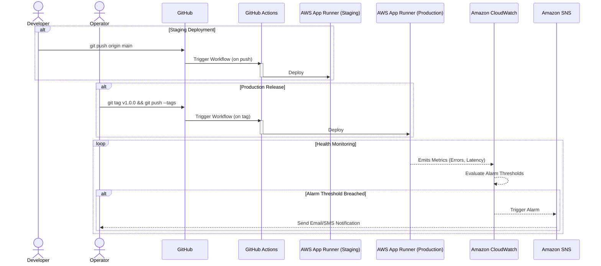

#### **Production Environment Deployment & Monitoring**

*   **Problem:**
    1.  The service only deploys to a non-production "staging" environment. There is no isolated, stable environment to serve live user traffic, which is the ultimate goal of the project.
    2.  The deployment process is tied directly to the `main` branch, which is not suitable for production. Production releases must be deliberate, explicit, and versioned acts.
    3.  There is no monitoring. If the service fails in production, we will be unaware until users report the outage, which is unacceptable for a production-grade system.

*   **Solution:**
    1.  Provision a new, fully separate **Production Environment** using AWS App Runner. This environment will have its own configuration (e.g., instance size, environment variables for production secrets).
    2.  Update the CI/CD pipeline in GitHub Actions to support a promotion-based release strategy. Pushing to `main` will continue to deploy to Staging. Pushing a Git tag (e.g., `v1.0.0`) will trigger a new, distinct workflow to deploy the corresponding commit to the **Production Environment**.
    3.  Implement a foundational monitoring and alerting system. Configure **Amazon CloudWatch Alarms** on the production App Runner service to automatically detect critical failures (e.g., a high percentage of 5xx server errors, sustained high latency) and send a notification via **Amazon SNS** to a predefined operator email address.

*   **Trade-offs:**
    *   **Pros:**
        *   **Stability & Isolation:** A separate production environment is the most critical best practice for service reliability, protecting it from volatile development and testing activities.
        *   **Controlled Releases:** A tag-based deployment strategy creates an explicit, auditable release process. It ensures we know exactly what version of the code is running in production at all times.
        *   **Proactive Operations:** Alarms provide immediate feedback on the health of the production service, enabling a rapid response to incidents before they have a widespread impact.
    *   **Cons:**
        *   **Increased Cost:** Running a second, potentially larger, environment in AWS will incur additional costs. This is a necessary and standard operational cost for a production service.
        *   **CI/CD Complexity:** The GitHub Actions workflow will become more complex to handle the conditional logic for tag-based vs. branch-based deployments. This is a manageable and well-understood pattern.

#### **3. Design the Architecture-as-Code (AaC)**

The following artifacts define the architectural changes for this issue.

*   **Logical View (C4 System Context Diagram)**

    *This diagram updates our high-level context to show the new production environment and the monitoring/alerting loop.*

*   **Physical View (Deployment Process Diagram)**

    *This diagram shows the two distinct deployment workflows (staging vs. production) and the new monitoring loop.*

*   **Component-to-Resource Mapping Table**

| Logical Component | Physical Resource | Rationale (Why this choice?) |
| :--- | :--- | :--- |
| **Production Environment** | **AWS App Runner Service** | We will continue to use App Runner for its operational simplicity and fully managed nature. Creating a separate service provides the necessary resource and security isolation for production. |
| **Monitoring System** | **Amazon CloudWatch Alarms** | CloudWatch is the native, deeply integrated monitoring solution in AWS. It can directly monitor App Runner metrics (like 5xx errors and latency) out-of-the-box, providing the fastest path to effective monitoring with no extra setup. |
| **Alerting System** | **Amazon SNS (Simple Notification Service)** | SNS is the standard AWS "glue" service for fanning out notifications. It is reliable, scalable, and can easily be configured to send alerts via email, SMS, or to other systems like Slack via webhooks, providing future flexibility. |
