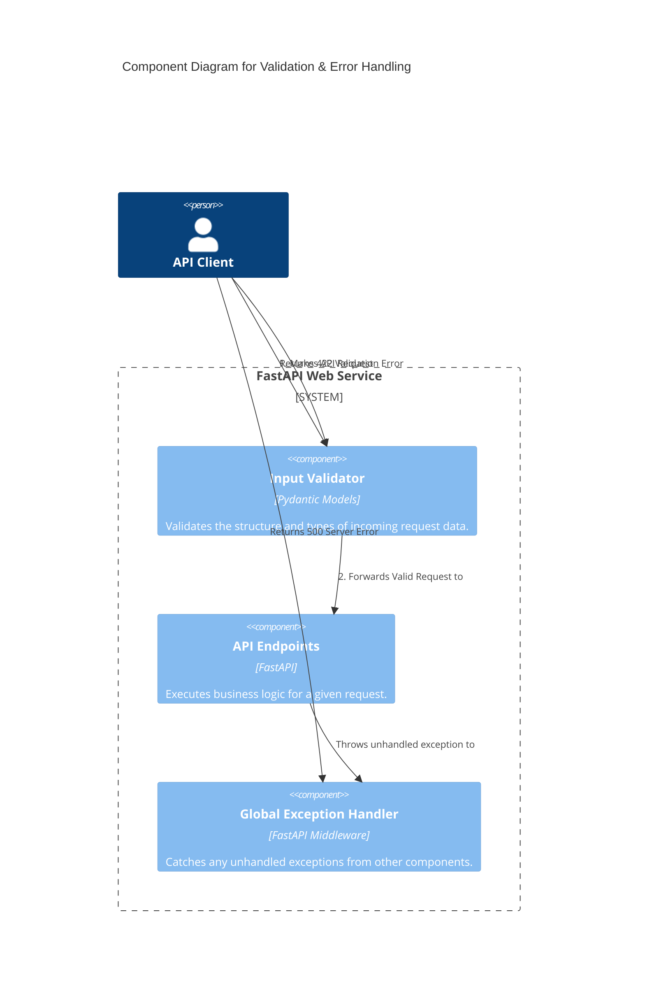
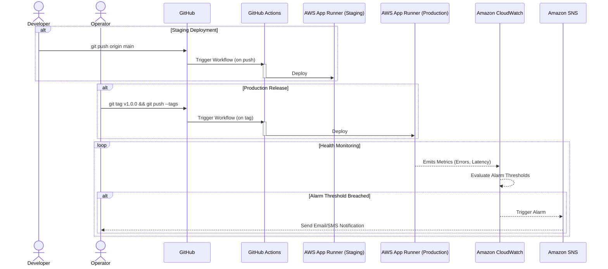

#### **Implement Robust Input Validation & Error Handling**

*   **Problem:**
    1.  While FastAPI provides some automatic validation, the service lacks a formalized strategy for handling malformed requests or unexpected data types, which could lead to unhandled exceptions.
    2.  When an unexpected internal error occurs (e.g., a `NullPointerException` equivalent), the default server behavior is to return an HTML stack trace. This leaks internal implementation details (a security risk) and breaks the JSON API contract for clients.

*   **Solution:**
    1.  **Input Validation:** We will formalize the rule that all incoming request bodies **must** be defined by a `Pydantic` model. This leverages FastAPI's built-in capabilities to automatically validate incoming data and return a structured `422 Unprocessable Entity` error for any validation failures.
    2.  **Error Handling:** We will implement a `Global Exception Handler`. This is a centralized middleware that will catch any unhandled exception that occurs during request processing. It will perform two critical actions:
        *   Log the full, detailed stack trace to our structured logging system for debugging by operators.
        *   Return a generic, standardized JSON error response to the client (e.g., `{"detail": "An internal server error occurred"}`) with a `500 Internal Server Error` status code, preserving the API contract without leaking sensitive information.

*   **Trade-offs:**
    *   **Pros:**
        *   **Security:** Prevents the leakage of internal stack traces to the public internet, hardening the service against information disclosure vulnerabilities.
        *   **Robustness:** The service becomes more resilient by gracefully handling unexpected errors instead of crashing or returning non-standard responses.
        *   **API Contract:** Provides a predictable, machine-readable error format for all API clients, which is essential for a professional, production-grade service.
        *   **Maintainability:** Centralizes all fallback error-handling logic in a single, well-defined location.
    *   **Cons:**
        *   Adds a small amount of boilerplate code for the handler. This is a standard and highly justified practice for building any production web service.

#### **Design the Architecture-as-Code (AaC)**

*   **Logical View (C4 Component Diagram)**

    *This diagram zooms inside the `FastAPI Web Service` to show how requests are processed and how errors are handled.*

*   **Physical View (Deployment Diagram)**

    *   **Decision:** The Physical View for this issue is **unchanged**.
    *   **Rationale:** These changes are purely at the application code level. They are packaged into the same Docker container artifact and run within the same Uvicorn process. No new infrastructure or physical resources are introduced, so the previously validated Physical View remains accurate.

*   **Component-to-Resource Mapping Table**

| Logical Component | Physical Resource | Rationale (Why this choice?) |
| :--- | :--- | :--- |
| **Input Validator** | **Pydantic Library** | Pydantic is natively and deeply integrated into FastAPI. It is the idiomatic and most powerful way to perform data validation, providing automatic error responses and generating OpenAPI schema documentation. |
| **Global Exception Handler** | **FastAPI Exception Handler (Middleware)** | Using the framework's native exception handling mechanism (`@app.exception_handler`) is the correct and most efficient way to implement this pattern. It guarantees that the handler will catch all relevant exceptions within the application's lifecycle. |
