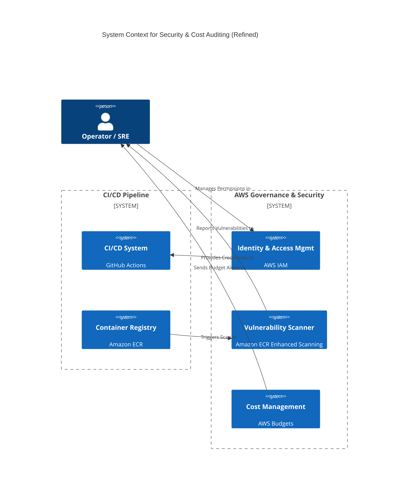
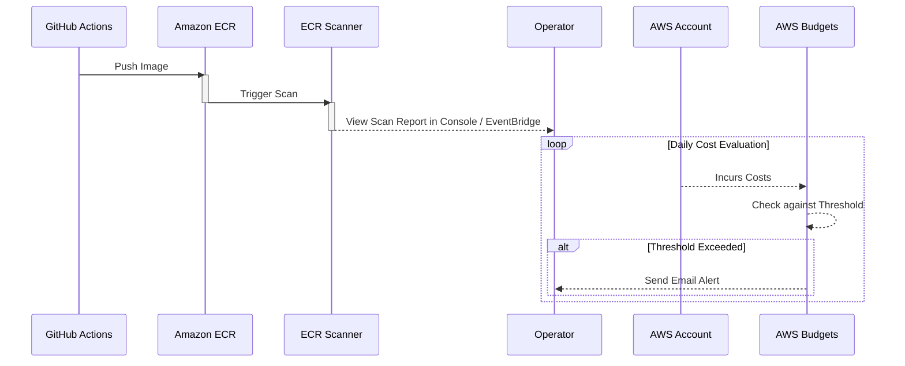

#### **Initial Security & Cost Audit**

*   **Problem:**
    1.  Our IAM roles and permissions were set up for initial deployment and may be overly permissive, violating the **Principle of Least Privilege** and creating an unnecessary security risk.
    2.  The Docker images we push to our container registry are not being scanned for known vulnerabilities (CVEs), meaning we could be deploying insecure code without being aware of it.
    3.  We have no automated cost controls in place. A misconfiguration or unexpected usage spike could lead to a significant and surprising bill.

*   **Solution:**
    1.  **IAM Review:** Conduct a formal review of the IAM roles used by the GitHub Actions pipeline and the AWS App Runner service. Tighten the policies to grant only the minimum permissions required for each service to function.
    2.  **Automated Vulnerability Scanning:** Enable and configure **Amazon ECR's enhanced scanning** feature. This will automatically scan every new image pushed to our repository for both operating system and programming language package vulnerabilities.
    3.  **Cost Alerting:** Create a new **AWS Budgets** alert. This alert will monitor our monthly spend and automatically send a notification to a designated operator email address if the cost exceeds a predefined threshold.

*   **Trade-offs:**
    *   **Pros:**
        *   **Reduced Attack Surface:** Implementing least privilege significantly reduces the potential impact of a compromised key or service.
        *   **Proactive Security:** Automated scanning provides an early warning system for security vulnerabilities, allowing us to patch them before they are deployed to production.
        *   **Financial Governance:** Cost alerts prevent budget overruns and provide essential financial visibility into the service's operational costs.
    *   **Cons:**
        *   **Operational Overhead:** Requires an initial time investment to review policies and configure alerts. This is a fundamental and non-negotiable aspect of responsible cloud operations.
        *   **Potential for False Positives:** Vulnerability scanners may occasionally flag low-risk issues, requiring a process for triaging and evaluating scan results.

#### **Design the Architecture-as-Code (AaC)**

*   **Logical View (C4 System Context Diagram)**

    *This diagram shows how AWS security and billing systems interact with our existing pipeline and personnel.*

*   **Physical View (Process Diagram)**

    *This diagram shows the two key automated processes: the vulnerability scan and the budget alert.*

*   **Component-to-Resource Mapping Table**

| Logical Concept | Physical Resource / Service | Rationale (Why this choice?) |
| :--- | :--- | :--- |
| **Identity & Access Mgmt**| **AWS IAM (Identity and Access Management)** | This is the fundamental, non-negotiable service for managing all permissions within AWS. There is no alternative. |
| **Vulnerability Scanner** | **Amazon ECR Enhanced Scanning (powered by Trivy)** | Using the native, built-in scanner is the most efficient choice. It is tightly integrated, requires no third-party setup, and provides immediate results within the ECR console, simplifying the workflow. |
| **Cost Management** | **AWS Budgets** | This is the native AWS service for cost control. It is simple to set up, provides reliable alerting via email or SNS, and is the standard, best-practice tool for preventing budget overruns in AWS. |
